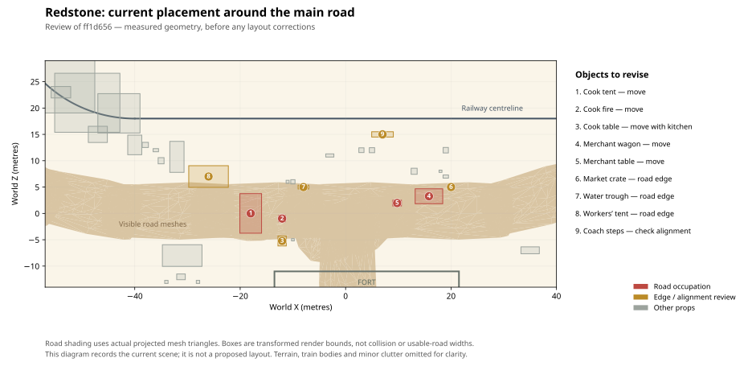

# Redstone placement review

Original review against commit `ff1d656` on 2026-09-30. The inventory and plan
below record that earlier layout. The accepted correction pass is now implemented
in content version `deathward-m1-40`; see the applied changes immediately below.

## Applied corrections

- The kitchen moved into a court west of the fort. Its entrance faces the fire
  and serving space, with its table inside the canvas shelter.
- The merchant wagon, counter and stock moved to a roadside pull-off. Water and
  barrels sit away from the road, with customer and passenger approaches clear.
- The prospectors' wagon and tent moved onto the low ground near the badlands
  exit, with a direct wagon approach from the road. The elevated settler tent
  joined the lower family camp.
- Twelve connected picket sections replace the five separated sections. One
  deliberate entrance is guarded; the existing army tent provides shelter inside.
  Its original cot is reused, and two stockpiles intersecting the fence are removed.
- The evidence desk and chest moved under the cabin porch. The redundant new
  chair was removed; the porch already has seating. The central doorway remains
  clear. Personal chests, lantern and household supplies moved under canvas.
- The witnesses retain their neighborhoods. The spiritualist's tent now opens
  toward the gathering, and the scout's logpile leaves his approach clear. The
  abandoned wagon retains its placement with a reserved gathering space nearby.
- Resident positions and routes follow the moved services. Full prefab extents
  and five reserved circulation spaces guide loose-clutter removal; an audit
  rejects added props inside those spaces. Dead-tree naming variants are handled.

The sand piles and parked train were retained. Wider suggestions below, such as
changing flags, redesigning the sand drifts, storm phases and new work animations,
remain separate from these accepted placement corrections.

The current layout has 69 authored prop groups, 15 residents and 15 tents. The
212-entry mesh catalog, GLB and embedded textures are unchanged. Browser startup
updates the known untouched first-story scene/navigation pair; edited saves keep
their authored layout. Fresh installs receive the corrected layout directly.

## Original audit

The physical hub has the necessary story locations, but several placements do
not make sense as places people would use. The main mistake was checking player
reachability without reserving space for the road, wagon access, tent entrances,
work and conversation. Being able to walk around a tent does not justify pitching
it across a road.

The inventory below covers **all 64 newly authored prop groups and all 15
residents** in `scripts/redstone_story_layout.json`. A group can contain multiple
mesh instances. The inherited fort, railway, original camp and landscape are
reviewed by function, not as 994 separate scene instances.

Evidence: the committed layout and manifest; transformed full-prefab bounds;
actual road mesh triangles; and the arrival, market, railway, fort, camp and
wagon renders under `artifacts/redstone-*.png`. Bounds indicate extent, not an
exact collision shape. No new physical clearance simulation was performed.

## Findings that change the layout

- **Clear the road first.** The cook tent at `(-18, 0)` and fire at `(-12, -1)`
  occupy it. The merchant wagon at `(15, 3)` and trading table at `(10, 2)` do too.
  Move the kitchen and market into separate side courts with paths to the road.
  The workers' tent, trough and some supplies also intrude on its edge.
- **Reserve usable spaces before placing decoration.** Mark the through-road,
  fort gate approaches, passenger unloading strip, working railway shoulder,
  tent entrances and wagon access. Include guy ropes, shafts and people using
  furniture, not just object origins. A clear lane of roughly 5–6 metres is an
  initial game-layout target, not a historical or engineering standard; test it
  with the actual wagon footprint and its approach turns.
- **Give the railway obstruction a cause and a clearing process.** The current
  three repeated, enlarged dust piles read as separate boulders. Their increasing
  size and clean surroundings make them look deliberately placed.
- **Repair the custody space.** Fence sections are about 1.76 metres long but
  spaced 3 metres apart: approximately 1.24-metre gaps remain. This is not a
  continuous holding enclosure. Join the fence runs, connect them to the fort,
  and provide one guarded opening and a conversation position outside it.
- **Move the elevated wagon cluster.** The prospector's wagon and one settler
  tent sit on a red rock shelf, conspicuous in the fort render. Grounding an
  object on a walkable surface does not establish a believable wagon route.
  Prefer the lower camp floor and group the prospectors' belongings together.
- **Make shelter visible.** An exposed evidence desk, uncovered personal
  belongings and several open fires currently suggest a calm camping day.
  Arrange them against shelter, then add the planned storm behavior. Do not
  rely on future fog to explain contradictory placement.

## Sand or rocks across the railway?

Rocks would communicate an impassable obstruction more immediately at the normal
camera distance. They are a valid alternative, but need to read as a local
rockfall: a visible source face, matching stone, debris leading from the slope to
the track, and a worksite for clearing it. Replacing each existing sand lump with
a rock would preserve the current artificial arrangement.

Windblown sand on desert railway lines is a real maintenance concern. The
National Park Service describes the windbreaks at Kelso as keeping sand off the
tracks. That supports the setting, without establishing a particular burial
depth or reopening time for our fictional storm.
[NPS: Kelso and Trains](https://www.nps.gov/moja/kelso-and-trains.htm).

A major rockfall adds another narrative obligation: explain how the line becomes
safe again. Real landslip recovery can require stabilizing the slope as well as
clearing material. This is a reason to avoid implying that a large collapse is
resolved merely because the wind stops.
[Network Rail: Preventing landslips around the railway](https://www.networkrail.co.uk/stories/preventing-landslips-around-the-railway/).

**Recommendation for the supplied story: keep sand as the primary obstruction,
but rebuild its shape and staging.** The storm buries the line and workers uncover
it at the ending; this keeps those events connected. Use one connected drift
crossing a short cutting, feathered into the surrounding ground. Show visible
rails disappearing under it, sand on nearby sleepers, a partially dug channel,
and spoil beside the work area. Workers should return to this same area between
story phases. A few small stones may belong in the terrain; they should not
silently introduce a second disaster.

If immediate rockfall readability is preferred, use a **modest localized fall**
with that visible source and ongoing clearing. Revise the story explanation to
"debris blocks the line, and the storm prevents the crew from finishing" and
show the crew's progress before the morning departure. This is an alternative
story choice; this review does not apply it to the map.

## Every added prop

Coordinates below are current **X, Z**, in metres. "Keep" retains the role and
general location; it does not certify every contact point or interaction that
has yet to be implemented. "Verify" marks something the current evidence does
not settle. New positions should be chosen from a complete scene view after the
circulation spaces are reserved, rather than moving objects by an arbitrary
offset and creating another conflict.

### Arrival: 5 groups

| ID | Current X, Z | Reason for being here | Decision |
| --- | --- | --- | --- |
| `arrival-trunk-a` | 3, 12 | Establish arriving passengers and belongings. | Keep near the coach, but group with its owner at the side of the unloading route. |
| `arrival-trunk-b` | 5, 12 | A second passenger's luggage. | Consolidate with the first group; the evenly separated cases currently resemble dropped collectibles. |
| `arrival-trunk-c` | 19, 12 | Serve the other carriage. | Keep a second luggage group near that carriage's access point, outside its approach. |
| `arrival-steps` | 7, 15 | Explain how passengers leave the train without a station. | Verify the top landing against the actual coach entrance and tread direction. Bounds alone do not prove a usable connection; the current prop is a scaled building staircase. |
| `arrival-bench` | -3, 11 | Temporary waiting seat. | Replace with recognizable seating, or treat it explicitly as luggage. The stretched crate currently reads as a crate, not a bench. |

### Market and water: 9 groups

| ID | Current X, Z | Reason for being here | Decision |
| --- | --- | --- | --- |
| `merchant-wagon` | 15, 3 | A merchant trades with stranded travelers. | Move off the road to a pull-off. Face the service side into a small customer space; preserve a route by which the wagon could arrive and leave. |
| `market-crate-0` | 19, 7 | Merchant stock. | Regroup against the wagon's storage side, leaving access to the service side. |
| `market-crate-1` | 20, 5 | Merchant stock. | Move away from the road edge with the wagon. Its current detached position consumes circulation space. |
| `market-crate-2` | 13, 8 | More stock or unloading. | Consolidate with the other stock; retain a separate box only if it helps show a current unloading task. |
| `market-table` | 10, 2 | Display and transactions. | Move off the road and close enough to the wagon to read as its counter. Reserve space for both merchant and customer. |
| `market-sack` | 18, 8 | Food or dry goods. | Keep within the stock group and under cover; avoid another isolated object on the passenger side. |
| `water-trough` | -8, 5 | Watering animals and a meeting point. | Move fully onto a roadside turnout with approach room along its length. Establish a visible water supply; a trough alone does not explain how the settlement is sustained. |
| `water-barrel-0` | -11, 6 | Reserve water. | Keep beside the trough's supply side, clear of the road and drinking side. Use a filled/covered presentation where available. |
| `water-barrel-1` | -10, 6 | Additional reserve. | Keep as part of that same compact group; do not scatter it merely to add detail. |

### Kitchen: 4 groups

| ID | Current X, Z | Reason for being here | Decision |
| --- | --- | --- | --- |
| `cook-tent` | -18, 0 | Shared food shelter and kitchen stores. | Move the entire kitchen to a side court. Its current footprint, approximately X -20.06 to -15.94 and Z -3.75 to 3.75, lies across the road. |
| `cook-fire` | -12, -1 | Cooking and gathering. | Move with the kitchen, into a sheltered open part of the court. Keep its approach and seating out of traffic and clear of canvas and guy ropes. |
| `cook-table` | -12, -5 | Preparing or serving food. | Move beside the kitchen entrance, with a preparation side and a serving side. The current road-edge placement splits the kitchen across traffic. |
| `cook-chair` | -10, -5 | Resting or eating. | Place facing the table/fire in the court. Do not use a chair to fill the gap between kitchen and road. |

### Railway worksite and obstruction: 11 groups

| ID | Current X, Z | Reason for being here | Decision |
| --- | --- | --- | --- |
| `railworkers-tent` | -26, 7 | Crew shelter near the stranded train. | Pull farther off the road and orient the entrance toward the work yard. The current footprint reaches Z 4.94, into the road's visual edge. Include ropes in clearance. |
| `rail-supply-wagon` | -32, 10 | Bring tools and carry spoil or supplies. | Keep the worksite association, but align its shafts with a clear wagon approach. Reserve loading space between it and the obstruction. |
| `rail-supplies-0` | -36, 12 | Crew equipment. | Consolidate at the wagon's unloading side. Add a recognizable work tool when available so the group explains railway work. |
| `rail-supplies-1` | -38, 13 | Equipment nearest the work front. | Keep only if deliberately staged at the work front; otherwise move into storage. Avoid a trail of evenly spaced boxes. |
| `rail-supplies-2` | -35, 10 | Worksite stores. | Use this as the main storage cluster, with access from both wagon and crew shelter. |
| `rail-barricade-0` | -40, 13 | Warn passengers away from the work area. | Replace the defensive spikes with a simple warning barrier/marker at one readable entry. Spikes currently suggest combat defenses. |
| `rail-barricade-1` | -47, 15 | Mark the obstruction perimeter. | Remove unless it closes a real pedestrian approach; the isolated barricade adds little explanation. |
| `rail-barricade-2` | -54, 23 | Mark the far side of the work front. | Keep a marker only if people can approach from that side. Preserve workers' access; avoid fencing the track without a purpose. |
| `rail-drift-0` | -43, 19 | First visible burial of the outgoing rails. | Replace the distinct mound with the low leading edge of one drift. Show the transition from visible sleepers to buried track. |
| `rail-drift-1` | -49, 21 | Main blockage. | Rebuild as the continuous body of the drift, tied into the terrain rather than a second isolated lump. |
| `rail-drift-2` | -55, 27 | Continue the blockage around the bend. | Reduce the repeated silhouette and blend into the cutting. Its transformed bounds reach about Y 2.29 and span roughly 15 metres in X; scale alone is doing too much visual work. |

### Wife's shelter: 4 groups

| ID | Current X, Z | Reason for being here | Decision |
| --- | --- | --- | --- |
| `wife-shelter` | -28, -25 | Private accommodation near help and the settlement. | Keep this quieter neighborhood. Orient its entrance toward a small conversation space, with an obvious connection back to the shared camp. |
| `wife-chair` | -25, -22 | A place to sit and receive a visitor. | Keep, facing the sheltered conversation space rather than exposing her to passing traffic. |
| `wife-chest` | -31, -24 | Personal belongings. | Move inside or directly under the shelter's cover. The isolated outdoor chest currently looks like a loot container. |
| `wife-lantern` | -25, -24 | Identify the entrance after dark. | Mount or place at the entrance on a support; a small lantern loose on the ground is easy to miss and gives little ownership context. |

### Spiritualist: 5 groups

| ID | Current X, Z | Reason for being here | Decision |
| --- | --- | --- | --- |
| `spiritualist-tent` | -31, -8 | An ordinary gathering shelter among settlers. | Keep the neighborhood but verify door orientation. Put the gathering on the sheltered side; avoid road-edge tent ropes. |
| `spiritualist-table` | -31, -12 | A focal point for testimony and conversation. | Bring under cover or into a sheltered apron. Ordinary belongings should establish its use without confirming supernatural powers. |
| `gathering-chair-0` | -34, -13 | Listener's seat. | Keep on one side of the table; align it to face the speaker. |
| `gathering-chair-1` | -31, -15 | Listener's seat opposite the speaker. | Keep, with an open way into the gathering; do not close the whole apron with seats. |
| `gathering-chair-2` | -28, -13 | A third participant or skeptic. | Keep if the conversation space supports it. Space for characters matters more than a symmetrical three-chair arrangement. |

### Settlers: 9 groups

| ID | Current X, Z | Reason for being here | Decision |
| --- | --- | --- | --- |
| `settler-tent-0` | -31, -35 | Extend the existing family camp toward the witnesses. | Keep; turn the entrance toward a shared footpath rather than a neighboring tent's back. |
| `settler-supplies-0` | -29, -32 | Belongings for tent 0. | Keep beside its entrance, outside the entrance apron and ropes. |
| `settler-tent-1` | -38, -41 | Make the camp edge feel inhabited before the final wagon. | Keep the neighborhood; preserve a continuous footpath to the old camp and wagon. |
| `settler-supplies-1` | -36, -38 | Belongings for tent 1. | Verify corner/rope clearance. Its bounds overlap the rotated tent's enclosing rectangle; that is a review flag, not proof of mesh intersection. |
| `settler-tent-2` | 13, -50 | Household on the fort's other side. | Keep if tied to a shared courtyard with family fire and a clear path around the fort. Avoid making isolated tents solely to fill space. |
| `settler-supplies-2` | 15, -47 | Belongings for tent 2. | Move close to its sheltered side, clear of the route to the family fire. |
| `settler-tent-3` | 23, -53 | Second household in this cluster. | Move off the elevated rock shelf onto a coherent camp floor. Its current height separates it visually from its supposed shared fire. |
| `settler-supplies-3` | 25, -50 | Belongings for tent 3. | Move with the tent and establish one accessible household apron. |
| `family-fire` | 16, -45 | Shared cooking and social space. | Keep the role, reposition after the tents. Reserve gathering space and a bypass along the fort instead of making everyone walk through the fire group. |

### Final wagon: 1 group

| ID | Current X, Z | Reason for being here | Decision |
| --- | --- | --- | --- |
| `abandoned-wagon` | -38, -58 | Familiar, peripheral location for the late discovery. | Keep the current quiet camp edge and clear approach. Establish that it could have been parked here, retain room for the later crowd, and avoid an early objective marker that advertises the ending. |

### Scout and prospectors: 6 groups

| ID | Current X, Z | Reason for being here | Decision |
| --- | --- | --- | --- |
| `scout-shelter` | 29, -25 | A useful local guide lives near the badlands side. | Keep this side of the fort. Make the trail connection visible and give the entrance room without implying that isolation makes him guilty. |
| `scout-fire` | 29, -19 | Ordinary working camp. | Keep only in a sheltered clearing beside the shelter, leaving the fort-side route free. Consider sharing a fire with neighbors rather than assigning every role a separate flame. |
| `scout-logpile` | 31, -22 | Fuel storage. | Shorten or reposition beside the shelter. Its rotated enclosing bounds overlap the tent's bounds and approach the fire; inspect actual logs and ropes before accepting it. |
| `prospector-tent` | 35, -34 | Prospectors waiting out the interruption. | Group with their wagon and working equipment on one accessible surface. The current belongings are scattered across different heights. |
| `prospector-wagon` | 29, -45 | Supplies and transport. | Move down from the rock shelf. A plausible wheel route to the camp is required; player reachability on the shelf is insufficient. |
| `prospector-crates` | 33, -39 | Tools or ore supplies. | Move with the wagon, using visible work equipment to distinguish prospectors from another generic household. |

### Holding yard: 6 groups

| ID | Current X, Z | Reason for being here | Decision |
| --- | --- | --- | --- |
| `holding-fence-0` | 15, -18 | Northern end of the western enclosure edge. | Rebuild around one guarded entrance; close its gap to section 1 and define its termination against the fort. |
| `holding-fence-1` | 15, -21 | Middle of the western edge. | Join to both neighbors. The current approximately 1.24-metre gaps defeat the enclosure. |
| `holding-fence-2` | 15, -24 | Western edge and southern corner. | Join section 1 and the southern run without leaving a diagonal corner opening. |
| `holding-fence-3` | 17, -25 | Southern edge. | Connect continuously to section 2 and section 4. Place based on real segment endpoints rather than a 3-metre grid. |
| `holding-fence-4` | 20, -25 | Tie the southern edge into the fort. | Close its gap to section 3 and verify a sealed connection to the existing wall. |
| `holding-bed` | 18, -21 | Show that custody lasts beyond one conversation. | Keep within the enclosure, sheltered from the storm, with room for the outlaw to stand and speak through the guarded opening. |

### Command and departure: 4 groups

| ID | Current X, Z | Reason for being here | Decision |
| --- | --- | --- | --- |
| `evidence-table` | 7, -29 | Examine recovered objects with the commander. | Move under the existing command shelter or add a covered apron. Preserve the central courtyard route and space for two people to discuss an object. |
| `evidence-chest` | 9, -30 | Store recovered objects between expeditions. | Keep with the command area, protected and visibly controlled by its occupants. It should not resemble an unattended reward chest. |
| `evidence-chair` | 7, -31 | Make the desk a working place. | Move with the desk; face the usable side and retain passage behind it. |
| `trail-barricade` | 35, -7 | Identify the controlled route into the badlands. | Keep beside a clearly open trail with a guard or marker explaining its purpose. The current isolated spikes do not, by themselves, establish a checkpoint. |

## Residents and routes

All models are provisional. The bandit model's visible weapon and the repeated
two-character appearance should not accidentally imply that every resident is
an armed outlaw. Role names alone will not carry that distinction in play.

| Character ID | Placement reasoning and correction |
| --- | --- |
| `story-commander` | Keep at the command area with sight of the courtyard; relocate with the sheltered evidence desk. |
| `story-outlaw` | Keep inside a genuinely closed enclosure. Provide a clear talking position on the visitor's side, not a route into custody. |
| `story-guard` | Change the patrol to maintain oversight of the actual opening. Walking alongside a porous fence currently communicates little control. |
| `story-wife` | Keep by her private shelter with room for a respectful conversation; avoid placing her in the main gossip queue. |
| `story-spiritualist` | Face the listeners from the table/shelter. Give the group room without staging his version as an authoritative revelation. |
| `story-scout` | Keep near his working camp and trail connection. Later routes should show him participating in camp life, so the final act grows from a familiar person. |
| `story-merchant` | Move to the wagon's service side and face the customer apron, after moving the market off the road. |
| `story-cook` | Move with the kitchen. Use a short preparation/fire/service routine once suitable actions exist, not a stationary person in traffic. |
| `story-passenger-one` | Connect the coach and luggage to shelter or water. The current two nearby stops provide movement but little destination. |
| `story-passenger-two` | Give a distinct destination such as the merchant or waiting area; preserve the unloading strip. |
| `story-rail-worker-one` | Connect supplies to the exposed edge of the obstruction; use work pauses so the closure has visible ongoing attention. |
| `story-rail-worker-two` | Connect crew shelter, water and supply wagon. Keep movement out of the train's eventual clearance envelope. |
| `story-settler` | Keep a local household route, extended to a shared service or conversation spot instead of walking only between empty points. |
| `story-prospector` | Relocate with the revised wagon/tent cluster. Show a task at the supplies and a reason to visit the camp. |
| `story-camp-visitor` | Give the route a recognizable destination at the family court or original camp, preserving passage around the fort. |

## Inherited scene and missing context

| Element | Assessment |
| --- | --- |
| Fort footprint and canyon scale | Keep. They are the approved spatial foundation; these corrections do not require shrinking the map. |
| Original fort furniture and fires | Review as occupied spaces when placing the new desk/custody area. Existing props need owners and clear approaches too; imported does not mean automatically appropriate. |
| Fort flags | The imported Confederate imagery makes a specific faction/period statement the brief has not established. Choose the fort's identity deliberately before treating those flags as final decoration. |
| Original settler wagons | Keep the recognizable household cluster, but audit shafts, unloading room, laundry, entrances and fire access as one shared space. |
| Green camp ground and vegetation | The sharply bounded green patch makes the reused camp visibly separate from the canyon. Blend the ground treatment, or establish a supported water source if greenery is intentional. Do not undo the approved terrain offset. |
| Train | Keep parked during the blockade. Ensure the future departure clears luggage, steps and workers; a zero-speed setting alone does not provide the ending sequence. |
| Railway loop and bridge | Preserve the approved geometry for this correction. The fully visible loop still reads as a demonstration circuit rather than a westbound route; a later composition pass can conceal its return with terrain/view framing, without resizing the hub. |
| Road and fort approaches | Treat the existing road as a settlement constraint. Preserve its gate connection and provide deliberate branches into courts rather than putting activities across it. |
| Cliff and rock placement | Keep major landforms; do not interpret every walkable rock top as a tent or wagon site. Objects need believable arrival and daily-use routes. |
| Loose bushes, stones and dead trees | Audit complete footprints around entrances, shafts, ropes and work areas. The current origin-based 4-metre clutter clearing is too coarse to guarantee these spaces. |
| Fires and weather | The current bright, calm scene does not communicate an ongoing storm. Plan sheltered fires, coherent wind direction, drifting sand and sound, with readable paths and faces. |
| Everyday support | Water resupply, animal tethering/feeding, waste disposal and meaningful work are underexplained. Add only the items that establish these functions; more random crates will not do it. |

## Order of correction and acceptance

1. Reserve road, gate, unloading and wagon-access spaces. Move kitchen and market
   as coherent groups, then relocate their actors and routes.
2. Fix the enclosure and move the elevated wagon/household cluster to accessible
   camp ground. Verify stairs, all tent entrances, ropes and logpile clearance.
3. Rebuild the railway obstruction and worksite using the chosen narrative.
   Plan its partially cleared and departure states at the same time.
4. Shelter the desk and belongings; consolidate supplies and align chairs, doors,
   service sides and conversation positions.
5. Add purposeful resident destinations and review from the normal 160% camera,
   including camera rotation and player-occlusion transparency.

Acceptance requires both routes and visual reasoning: walk the player paths,
check wagon approach/turning footprints, inspect enclosure endpoints and terrain
contacts, and render before/after views. Retain native and browser scene/editor
checks when changes are implemented. This audit adds no runtime changes, so it
does not require rebuilding the game.
