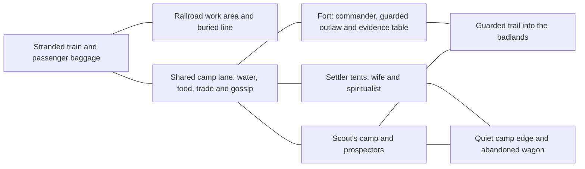

# Redstone: the stranded-train story hub

Status: the first physical hub milestone is implemented. The restored canyon's
scale, fort and original rail route are preserved. Added spaces include the
stranded-train arrival, buried outgoing line, railroad supplies, merchant wagon,
cookfires, witness shelters, holding yard, evidence table and abandoned wagon.
Fifteen provisional residents use the existing cowgirl and bandit models, with
editable positions and routes. Dialogue, testimony expeditions, evidence systems,
storm phases and the final event remain planned.

The [placement review](redstone_placement_review.md) records the original audit
and the accepted corrections. The kitchen and market now sit beside the road,
the holding fence has continuous runs and one guarded entrance, the prospectors
use a level pull-off, and the command desk and personal belongings have shelter.
The sand blockage remains as requested.

The road is now a 3.8-metre wagon track with a low crown and a narrower fort
approach. Hitching rails, water and feed occupy the western frontage; cart
repairs and timber occupy the eastern side. A bench and notice board serve
people waiting at the gate. Small worn paths and irregular dry scrub connect
these spaces while leaving the wagon route and court entrances clear.
The fort floor ends inside the walls, with a narrow graded bank joining the
canyon. The footpaths follow that ground continuously, rather than cutting
through the former raised apron.

## Story commitments

The player is traveling west by train to meet their wealthy family. A violent
sandstorm buries the line ahead and strands the passengers at an old military
fort surrounded by a sprawling temporary settlement. Soldiers, settlers,
prospectors, railroad workers, merchants and drifters are waiting out the storm.
There is no known reopening time.

Three days before the player's arrival, a party went into the badlands to survey
a route. A wealthy railroad surveyor died. His wife was recovered alive, a notorious
outlaw was captured nearby, and a local scout claims to have discovered the body.
The commander is occupied with protecting the settlement and sends the player to
investigate beyond the walls.

The murder takes place in the badlands. The hub is where people tell, defend and
revise their accounts, interpret recovered objects, and live with the consequences.

| Account | What its speaker claims | What the game must leave open |
| --- | --- | --- |
| Outlaw | He pursued the surveyor's payroll-cache map and attacked the couple, but killed the husband in a fair gunfight. | Whether there was a fair duel, and what he omits to preserve his reputation. |
| Wife | The outlaw fled after assaulting her. Her freed husband looked at her with disgust; she raised his revolver, lost awareness, and awoke to find him dead. | What happened during the gap, and whether she fired the fatal shot. |
| Spiritualist, speaking for the dead man | The wife urged the outlaw to murder her husband. Abandoned by both, the husband killed himself. | The source and reliability of the account, including whether it is supernatural at all. |
| Scout | He witnessed a frightened, clumsy fight in which the outlaw killed the surveyor almost accidentally. | Whether he witnessed all of it and whether the missing valuable object implicates him. |

The scout's late account remains testimony. Neither an authoritative flashback
nor a hidden narrator declares it the solution. Some facts can become well
supported without establishing a complete murder sequence.

As the storm weakens, crying draws people to an abandoned wagon at the camp edge.
Someone searches for valuables. The scout objects and is accused of stealing
from the murder scene. He eventually takes the abandoned child, saying that he
already has children and can care for one more. That act does not settle his
account or erase possible wrongdoing.

By morning, workers uncover the tracks and the train leaves westward. The player
departs with less certainty about the murder and a fuller understanding of the
people. Departure must not require selecting a correct killer or completing every
possible procedural expedition.

## Shape of the hub

Keep the restored canyon's overall scale. Build density and useful routes around
the existing fort and camp instead of shrinking terrain or buildings. A sprawling
camp should have recognizable neighborhoods and short routes between frequently
visited people, with quieter peripheral spaces around them.

The diagram shows proposed relationships, not surveyed positions or a replacement
for the restored scene's coordinates.

| Place | Physical treatment | Story and play function |
| --- | --- | --- |
| Train arrival | Parked locomotive and carriages, improvised disembarkation, baggage and passengers; no station building. | Establish the player's journey and social background. The same place becomes the departure scene. |
| Railroad works | Workers, tools, a supply wagon and visible drifts across the outgoing line. | Explain the delay through visible work and changing reports. Rails remain buried even when a sheltered foot trail is usable. |
| Fort courtyard | Command post, a guarded holding space and a table for recovered objects. | Commander briefings, outlaw testimony and conflicting military interpretations. |
| Wife's shelter | A private tent or sheltered wagon with space for an unhurried conversation. | Give her a place and agency beyond being discussed publicly as evidence. |
| Spiritualist's tent | A recognizable canvas gathering place among settlers, with ordinary belongings and nearby skeptics. | Host the claimed testimony of the dead man without certifying its source. |
| Scout's camp | An ordinary working camp near the trail, with supplies and useful local knowledge. | Make the scout helpful and fallible before the late account and accusation. |
| Shared camp lane | Cooking fires, water, merchant wagon, repairs and overlapping daily routes. | Let gossip cross social groups; support resupply and overheard disagreement. |
| Abandoned wagon | A recognizable wagon at the quieter camp edge, present from the beginning. | Let the final scene occur in an already familiar place. Crying, rather than a new glowing marker, changes its significance. |
| Badlands departure | A guarded, readable trail separate from the blocked railway. | Select a testimony and expedition, then return to familiar people and geography. |

The far railway return can eventually be concealed by canyon terrain so a parked
through-train reads naturally. Its existing animation can remain available for
the editor and the eventual departure; the story phase should control whether it
travels. Repeated circuits during the blockade would contradict the premise.

## A settlement that changes between returns

Use a stable hub layout with authored changes at story milestones:

1. **Arrival:** passengers disembark; workers establish that the line is blocked;
   shelters fill and the commander introduces the investigation.
2. **Waiting:** everyday work continues. The player meets the witnesses and chooses
   which account to follow. Wind is stronger in exposed lanes than near shelter.
3. **Revisions:** evidence and conversations unlock revised accounts. Reactions
   vary by person: belief, embarrassment, self-interest, skepticism or silence.
4. **Storm weakening:** activity shifts toward track clearing. The crying wagon
   draws a small crowd and leads to the accusation and the scout's decision.
5. **Departure:** the same train prepares to leave. People and objects remain;
   changed behavior and quieter weather carry the ending.

These are narrative phases, not a real-time deadline that can expire while the
player explores. Keep sheltered hub navigation readable even when the exposed
badlands are dangerous. Weather, sound and activity should explain the conditions
without covering the whole screen with opaque dust.

The commander's decision needs a short practical motivation. A possible line is
that the fort needs its soldiers guarding supplies and shelter while an outsider
can question people without the same local loyalties. The exact exchange remains
to be written; the player's willingness should also have a personal reason.

## Contract for testimony expeditions

Every expedition is presented as following an account. Describe the current
speaker and revision clearly when departing and returning. A generated scene
must never silently become an omniscient replay of the past.

- A testimony can change encounters, routes, evidence placement and parts of the
  landscape. The current hub, its inhabitants and established present-day events
  remain consistent between versions.
- Give each account recognizable patterns: the outlaw's self-dramatized duel,
  gaps and threats in the wife's recollection, the spiritualist's account of
  betrayal and suicide, and the scout's frightened, disorderly struggle. These
  are framing rules, not proof that any account is accurate.
- Each designed evidence set should support at least one claim and challenge
  another. Random selection may vary the journey; it should not randomly decide
  whether a critical contradiction exists or whether the story can progress.
- Record where an object was recovered, which expedition and testimony led to
  it, the player's observation, and the interpretations offered by different
  people. Finding an object and accepting someone's explanation are separate.
- Distinguish physical objects from impressions experienced within a
  reconstruction. A changed landscape is not automatically a present-day fact.
- Prevent reruns from producing duplicate unique story objects or treating one
  witness's repeated claim as several independent confirmations.
- Persist an expedition's seed, testimony revision, starting evidence state and
  generation version. Loading or retrying that expedition should reproduce it;
  a newly unlocked account can deliberately produce a different version.
- Unlock the ending through sufficient encounters with the people and their
  contradictions, rather than a hidden certainty percentage or a correct-killer
  flag. The final wagon scene remains authored, never dependent on a rare seed.

The precise boundary between physical exploration and subjective reconstruction
needs to be established in the first playable expedition. The player's notebook
and return conversations should make that distinction understandable.

## Fit with the current game

Existing pieces include the independent Redstone scene and navigation, textured
fort and wagon assets, train animation, campfire/steam effects, ambient character
routes, seeded canyon/mine missions, and campaign save/history infrastructure.

The Redstone train now stays parked. The expanded camp contains fifteen tents
and fifteen provisional residents. The mission board stands at the badlands
trail; existing mission objectives still concern miners, an altar and combat.
These are foundations for development, not an implemented version of the murder
investigation.

There are also concrete extension needs:

- `TownMotionPath` uses zero speed for the parked train, retaining its original
  route and wheel bindings. Story-controlled departure still needs wiring.
- The scene and editor now support cowgirl and bandit residents, with provisional
  witness IDs and nearby role labels. Distinct final witness models and
  conversations still need work; existing generic NPC dialogue does not provide
  this cast.
- Dust, lighting and audio systems are reusable. A phased sandstorm with safe
  shelter and readable interactions needs its own authoring and performance pass.
- Campaign flags and history exist. Structured claims, evidence provenance,
  testimony revisions and the ending require additions, with save migration.
- The current canyon enemy roster is Isaac-inspired. How combat belongs in this
  story remains a design decision; reusing that roster unaltered would need an
  intentional explanation of the game's tone.

Keep the other hubs and existing missions available during development. The
story should be a distinct Redstone flow with its own progression.

## Implementation sequence

**First: the physical story hub (implemented).** Park the train, establish the buried outgoing
line, expand the camp into the neighborhoods above, add provisional witness
positions, reserve the final wagon, and identify the badlands exit. Preserve
building scale and the restored canyon's footprint. Review from the normal play
camera and by walking the important routes before adding a narrative system.

**Second: one complete return loop.** Meet one witness, follow a clearly labeled
account into one generated expedition, recover an object, return, and hear two
different interpretations. Save/reload must retain the account and object history.

**Third: conflicting accounts.** Add the other speakers, revisions, testimony
generation rules and interleaved hub reactions. Check that each version is
internally playable while none is silently privileged as objective truth.

**Fourth: the ending.** Author the weakening storm, crying wagon, accusation,
scout's care for the child, track clearance and departure. Test the sequence with
different evidence histories so ambiguity survives through the final scene.
